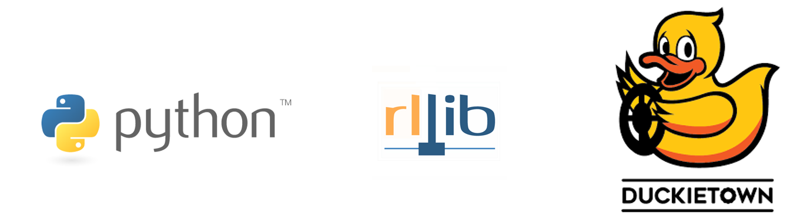
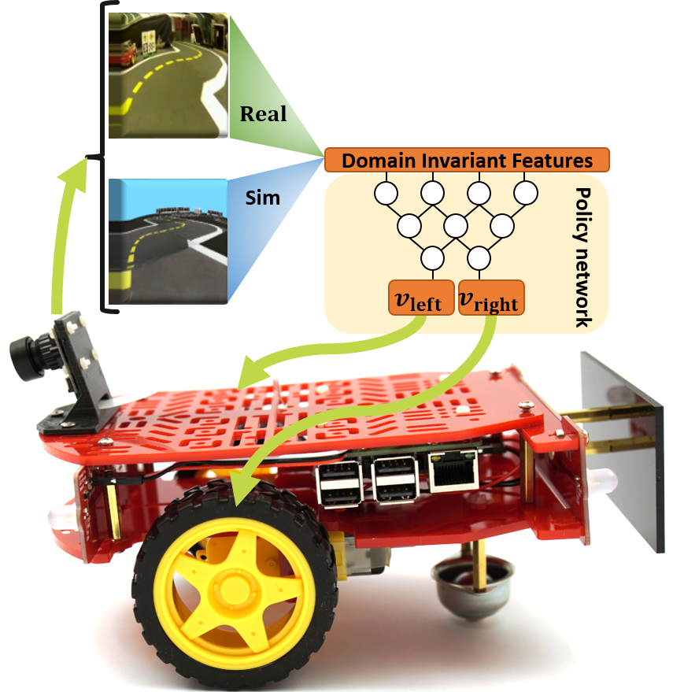
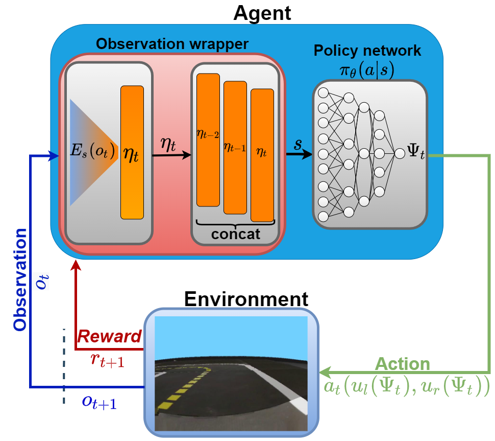

# Self Driving Agent training with Simulation-to-Real trasnfer using Python, Ray RLlib and gym-duckietown


This repository contains the steps of a tutorial to succesfully train a Reinforcement Learning agent using Domain \\
Randomization or Daomain Adaptation and Deep Reainforcement Learning to train an agent for self-driving in the Duckietown Gym environment.


# Outline 
[1. Setup Conda Environment](#setup_conda_environment)


[2. Manaul Control example](#manual_control)


[3. Tutorial 1: Training with Domain Randomization](#tutorial_dr)


[4. Tutorial 2: Training with Domain Adaptation](#tutorial_da)


[5. Testing in the Duckietown Gym Simulator](#testing_agent)

## Prerequisites
This tutorial currently works on Linux OS.
Anaconda and Python 3.7 is required. 


## 1. Setup Conda Environment
Run conda environment setup:
```$ bash setup_conda_environment.sh```

Run jupyter notebook:
```$ xvfb-run -a -s "-screen 0 1400x900x24" jupyter notebook  --ip 0.0.0.0 --port <portnumber> --no-browser --allow-root  ```

or

Run jupyter lab:
```$ xvfb-run -a -s "-screen 0 1400x900x24" jupyter lab  --ip 0.0.0.0 --port <portnumber> --no-browser --allow-root  ```

* Access your editor with a browser http://localhost:<portnumber>


## 2. Manual Control example
  
  
Open **00. Testing the simulator.ipynb** and follow instructions.
At this point you will be able to tun The Duckietown Gym environment and manual control the Duckiebot.
#manual_control

## 3. Tutorial 1: Training with Domain Randomization
  
  
  Open **01. Training tutorial.ipynb** and follow instructions.
  During the training the logs arre saved in the *artifacts/* directory.
  Use *tensorboard* to visualize the logs.
  

#tutorial_dr


## 4. Tutorial 2: Training with Domain Adaptation

  
 **TBD**
#tutorial_da


## 5. Testing in the Duckietown Gym Simulator
  
  
#testing_agent


